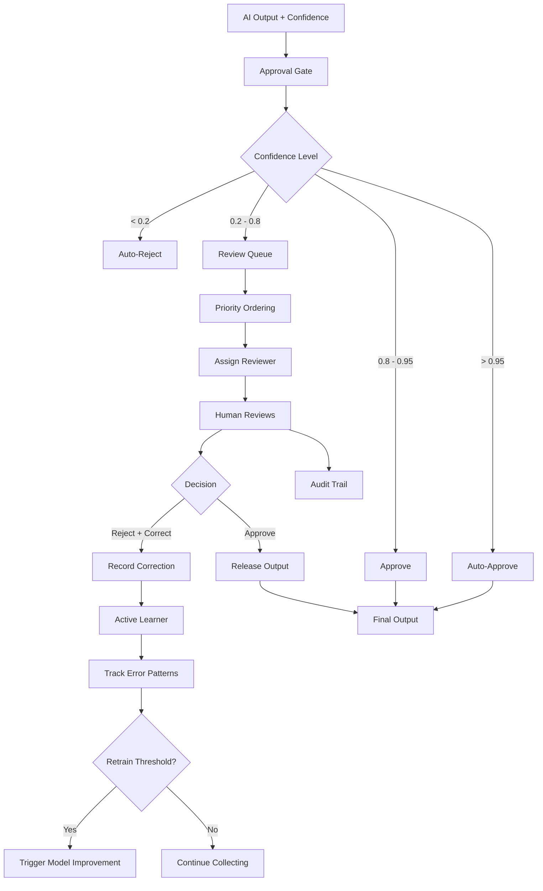

# AI GenAI Human-in-the-Loop

Human oversight patterns for AI workflows with approval gates, confidence-based routing, review queues, active learning from corrections, and decision audit trails.

## Objectives

- Understand confidence-based routing to automatically approve, reject, or escalate AI outputs based on configurable thresholds
- Design approval gate patterns that balance automation efficiency with human oversight requirements
- Implement priority-based review queues with round-robin assignment to distribute workload across reviewers
- Build active learning pipelines that capture human corrections and identify systematic error patterns
- Apply escalation strategies that route edge cases to appropriate decision-makers based on risk and uncertainty
- Create feedback loops where human decisions continuously improve model performance over time
- Construct complete audit trails for compliance, traceability, and post-hoc analysis of AI-assisted decisions
- Develop RESTful APIs that expose human-in-the-loop workflows as composable microservices
- Configure dynamic threshold tuning that adapts routing behavior as model confidence distributions shift
- Integrate structured logging and observability to monitor queue health, reviewer throughput, and learning progress

## Table of Contents
1. [Overview](#overview)
2. [Project Structure](#project-structure)
3. [Deployment](#deployment)
4. [API Reference](#api-reference)
5. [Testing](#testing)

---

## End-to-End Flow



---

## Overview

| Component | Description |
|-----------|-------------|
| Approval Gate | Confidence-based routing (auto-approve/reject/review) |
| Review Queue | Priority queue with round-robin reviewer assignment |
| Active Learner | Tracks corrections, identifies patterns, triggers retraining |
| Audit Trail | Complete decision history for compliance |

---

## Project Structure

```
ai-genai-human-in-the-loop/
├── src/human_in_the_loop/
│   ├── approval/gate.py          # Confidence-based routing
│   ├── queue/review_queue.py     # Priority review queue
│   ├── learning/active_learner.py # Learn from corrections
│   ├── api/router.py
│   └── main.py
├── tests/
├── config/
├── pyproject.toml, Dockerfile, docker-compose.yml
```

---

## Deployment

```bash
poetry install && cp .env.example .env
poetry run python -m uvicorn human_in_the_loop.main:app --reload --port 8000
poetry run pytest
docker-compose up --build
```

---

## API Reference

| Endpoint | Description |
|----------|-------------|
| POST /api/v1/hitl/submit | Submit AI output for review routing |
| GET /api/v1/hitl/queue | Get pending review items |
| POST /api/v1/hitl/decide | Submit human decision |
| POST /api/v1/hitl/reviewers | Register a reviewer |
| GET /api/v1/hitl/stats | Queue and learning stats |
| GET /api/v1/hitl/health | Health check |

---

## Testing

```bash
poetry run pytest --cov=src/human_in_the_loop --cov-report=term-missing
```
